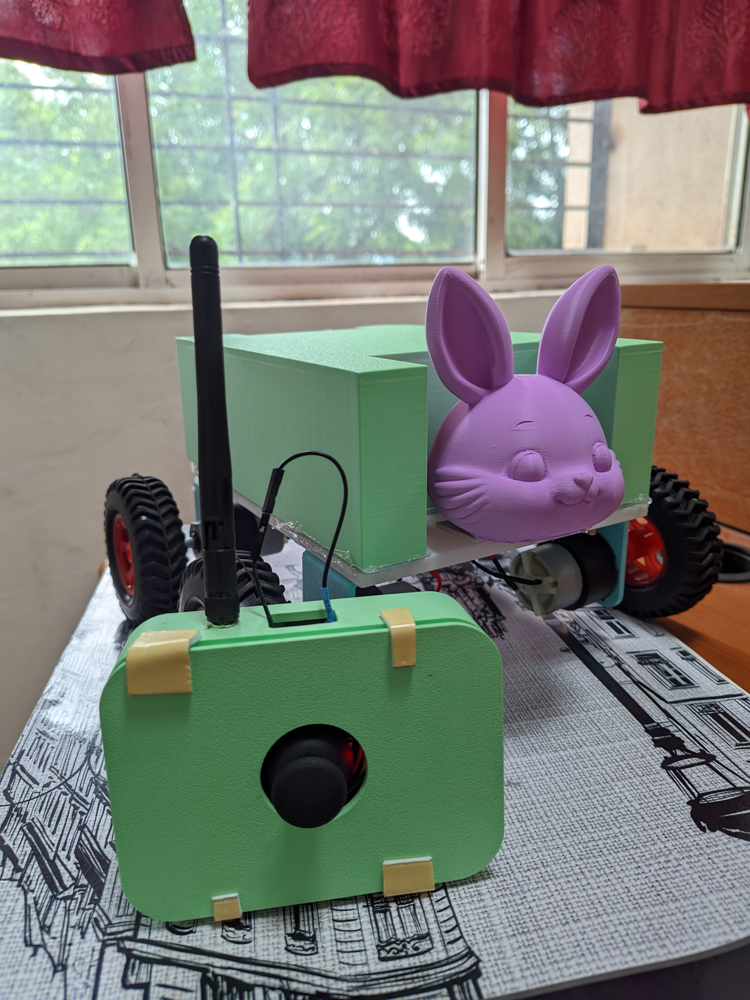

# Joystick Controlled RC Robot

A four-wheel remote-controlled robot developed during the Summer Internship Programme at NIT Rourkela. The robot is controlled wirelessly using a custom-built joystick controller. Two ESP32 boards are used for communication, with ESP-NOW used to transmit movement commands from the joystick to the robot.

## Project Overview

The project consists of two main units:

1. **Joystick Transmitter** – A custom-built controller using an ESP32 and a two-axis joystick module.
2. **Robot Receiver** – A four-wheel robotic vehicle using an ESP32, L298N motor driver, and four 12V DC geared motors.

The joystick sends movement commands wirelessly to the robot using the ESP-NOW communication protocol.

### System Architecture

```text
              CUSTOM JOYSTICK CONTROLLER
                        
          ┌──────────────────────────┐
          │        Joystick          │
          │      Module (X/Y)        │
          └────────────┬─────────────┘
                       │
                       ▼
          ┌──────────────────────────┐
          │          ESP32           │
          │       Transmitter        │
          └────────────┬─────────────┘
                       │
                       │ ESP-NOW
                       │ Wireless
                       ▼
          ┌──────────────────────────┐
          │          ESP32           │
          │         Receiver         │
          └────────────┬─────────────┘
                       │
                       ▼
          ┌──────────────────────────┐
          │          L298N           │
          │      Motor Driver        │
          └────────────┬─────────────┘
                       │
              ┌────────┴────────┐
              ▼                 ▼
       Left-side Motors    Right-side Motors
              │                 │
              └────────┬────────┘
                       ▼
                 4-Wheel Robot


```
---

## Features

- Four-wheel remote-controlled robot
- Custom-built joystick controller
- Wireless control using ESP-NOW
- ESP32-based transmitter and receiver
- Forward movement
- Backward movement
- Left movement
- Right movement
- Stop command
- Four 12V DC motors
- L298N dual H-bridge motor driver
- PWM-based motor speed control
- Battery-powered operation

---

## Hardware Components

### Robot / Receiver

| Component | Quantity |
|---|---:|
| ESP32 | 1 |
| 12V DC motors | 4 |
| L298N Dual H-Bridge Motor Driver | 1 |
| 80 mm robotic wheels | 4 |
| XL4015 Buck Converter | 1 |
| 18650 Li-ion cells | 3 |
| Battery holder | 1 |
| Robot chassis/frame | 1 |
| Motor mounting brackets | 4 |
| Power switch | 1 |
| Breadboard / terminal connections | As required |
| Jumper/connecting wires | As required |
| Screws, nuts and spacers | As required |

### Joystick / Transmitter

| Component | Quantity |
|---|---:|
| ESP32 | 1 |
| 2-axis joystick module | 1 |
| 18650 Li-ion cells | 2 |
| Buck converter | 1 |
| Battery holder | 1 |
| Power switch | 1 |
| Connecting wires | As required |
| Custom controller body/enclosure | 1 |

---

## Power Supply

### Robot

The robot is powered using three 18650 Li-ion cells connected as a 3-cell battery pack.

The battery pack provides a 12V-class supply for the robot system.

The battery supply is used for the motor driver and robot power system. An XL4015 buck converter is used to provide regulated voltage where required.

> A 3-cell Li-ion pack has a nominal voltage of approximately 11.1V and can reach approximately 12.6V when fully charged.

### Joystick Controller

The joystick controller is powered using two 18650 Li-ion cells.

A buck converter is used to regulate the battery voltage to approximately 5V for the joystick controller electronics.

---

## Wireless Communication

The joystick and robot communicate using **ESP-NOW**.

ESP-NOW allows the two ESP32 boards to communicate directly without requiring a Wi-Fi router or internet connection.

The transmitter reads the joystick position and converts it into a movement command.

The commands used in the project are:

| Command | Function |
|---|---|
| `F` | Forward |
| `B` | Backward |
| `L` | Left |
| `R` | Right |
| `S` | Stop |

The command is transmitted from the joystick ESP32 to the robot ESP32 using ESP-NOW.

---

## Joystick Transmitter

The transmitter consists of an ESP32 connected to a two-axis joystick module.

The joystick provides X-axis and Y-axis analog values. These values are processed by the ESP32 to determine the required movement direction.

### Joystick Pin Connections

| Joystick Signal | ESP32 GPIO |
|---|---:|
| X-axis | GPIO 34 |
| Y-axis | GPIO 35 |
| Switch | GPIO 32 |

### Movement Detection

The transmitter checks the joystick values and generates a corresponding command:

```text
Joystick Movement
       │
       ▼
Read X and Y Values
       │
       ▼
Determine Direction
       │
       ├── Forward  → F
       ├── Backward → B
       ├── Left     → L
       ├── Right    → R
       └── Neutral  → S

```
### Transmitter Code

The complete transmitter program is available in:

`transmitter/joystick_transmitter.ino`

The transmitter ESP32 reads the joystick values and sends the corresponding movement command to the robot using ESP-NOW.

---

## Robot Receiver

The robot uses a second ESP32 to receive the commands transmitted by the joystick controller.

The receiver processes the received command and controls the L298N motor driver.

The L298N controls the left and right motor groups of the four-wheel robot.

### Motor Driver Connections

| L298N Pin | ESP32 GPIO |
|---|---:|
| ENA | GPIO 16 |
| IN1 | GPIO 17 |
| IN2 | GPIO 18 |
| ENB | GPIO 1 |
| IN3 | GPIO 2 |
| IN4 | GPIO 4 |

### Motor Speed

The receiver program uses PWM control for motor speed.

The motor speed value used in the program is:

```text
230
```
### Receiver Code

The complete receiver program is available in:

`receiver/robot_receiver.ino`

The receiver ESP32 receives the movement commands from the joystick transmitter using ESP-NOW and controls the four DC motors through the L298N motor driver.

---

## Working Principle

The overall working process is:

1. The joystick controller is powered on.
2. The transmitter ESP32 initializes the ESP-NOW communication.
3. The robot receiver ESP32 initializes and waits for commands.
4. The joystick module provides X-axis and Y-axis values.
5. The transmitter processes these values.
6. A movement command is generated.
7. The command is transmitted wirelessly using ESP-NOW.
8. The receiver ESP32 receives the command.
9. The receiver controls the L298N motor driver.
10. The L298N drives the four DC motors according to the received command.
11. When the joystick returns to the neutral position, the stop command is sent.

---

## Movement Control

The robot supports the following movements:

| Joystick Action | Robot Movement |
|---|---|
| Joystick forward | Forward |
| Joystick backward | Backward |
| Joystick left | Left |
| Joystick right | Right |
| Joystick neutral | Stop |

---

## Software and Technologies

- **Programming Language:** C/C++
- **Development Environment:** Arduino IDE
- **Microcontroller:** ESP32
- **Wireless Protocol:** ESP-NOW
- **Motor Driver:** L298N Dual H-Bridge
- **Motor Control:** PWM
- **Power Regulation:** XL4015 Buck Converter

---

## Project Structure

```text
01_Joystick_Controlled_RC_Robot/
│
├── README.md
│
├── transmitter/
│   └── joystick_transmitter.ino
│
└── receiver/
    └── robot_receiver.ino
```
---

## How to Run

### Transmitter

1. Open `transmitter/joystick_transmitter.ino` in Arduino IDE.
2. Select the appropriate ESP32 board.
3. Connect the transmitter ESP32 to the computer.
4. Upload the program.
5. Power the joystick controller.

### Receiver

1. Open `receiver/robot_receiver.ino` in Arduino IDE.
2. Select the appropriate ESP32 board.
3. Connect the receiver ESP32 to the computer.
4. Upload the program.
5. Power the robot.
6. Power the joystick controller.
7. Use the joystick to control the robot.

---

## Project Outcome

A functional four-wheel wireless remote-controlled robot was successfully developed using two ESP32 boards.

The project demonstrated the integration of:

- Embedded programming
- ESP32 microcontrollers
- Wireless communication
- Joystick interfacing
- DC motor control
- Motor driver integration
- Battery-powered systems
- Voltage regulation
- Mechanical assembly

The project provided hands-on experience in designing and integrating both the robotic vehicle and its custom wireless controller.

---

## Future Improvements

Possible improvements include:

- Adding obstacle detection sensors
- Adding battery-level monitoring
- Implementing variable speed control
- Improving turning control
- Adding an emergency stop feature
- Adding a camera for remote monitoring
- Adding autonomous navigation
- Adding sensor feedback
- Developing a mobile or web-based control interface

---

## Internship

This project was developed as part of the **Summer Internship Programme (SIP) at NIT Rourkela**.

The project provided hands-on experience in robotics, embedded systems, wireless communication, motor control, and hardware integration.

## Media

### Robot and Joystick



### Demonstration Video

[Watch the robot demonstration video](media/robot_demo.mp4)
